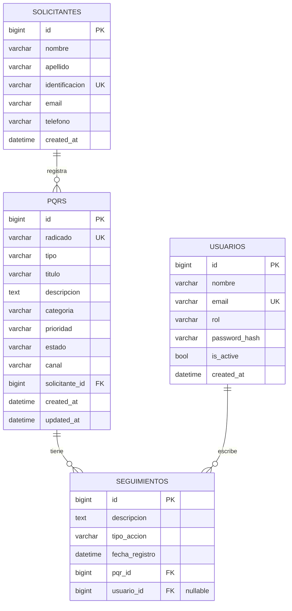

# Diagrama Entidad-Relación

Modelo implementado en Django (tablas `solicitantes`, `pqrs`, `seguimientos`, `usuarios`).

## Vista ER



## Cardinalidad e integridad

| Relación | Cardinalidad | On delete |
|----------|--------------|-----------|
| Solicitante → PQR | 1:N | `PROTECT` (no se borra un ciudadano con PQRs) |
| PQR → Seguimiento | 1:N | `CASCADE` |
| Usuario → Seguimiento | 1:N opcional | `SET NULL` |

## Catálogos (choices)

- **tipo:** peticion, queja, reclamo
- **prioridad:** baja, media, alta, urgente
- **estado:** recibida, en_gestion, resuelta, cerrada
- **canal:** web, email, presencial
- **rol:** agente, supervisor, admin
- **tipo_accion:** comentario, cambio_estado, cambio_prioridad, asignacion, sistema

## dbdiagram.io (opcional)

Se puede pegar esto en [dbdiagram.io](https://dbdiagram.io) para exportar PNG:

```dbml
Table solicitantes {
  id bigint [pk]
  nombre varchar
  apellido varchar
  identificacion varchar [unique]
  email varchar
  telefono varchar
  created_at datetime
}

Table usuarios {
  id bigint [pk]
  nombre varchar
  email varchar [unique]
  rol varchar
  password_hash varchar
  created_at datetime
}

Table pqrs {
  id bigint [pk]
  radicado varchar [unique]
  tipo varchar
  titulo varchar
  descripcion text
  categoria varchar
  prioridad varchar
  estado varchar
  canal varchar
  solicitante_id bigint [ref: > solicitantes.id]
  created_at datetime
  updated_at datetime
}

Table seguimientos {
  id bigint [pk]
  descripcion text
  tipo_accion varchar
  fecha_registro datetime
  pqr_id bigint [ref: > pqrs.id]
  usuario_id bigint [ref: > usuarios.id]
}
```
