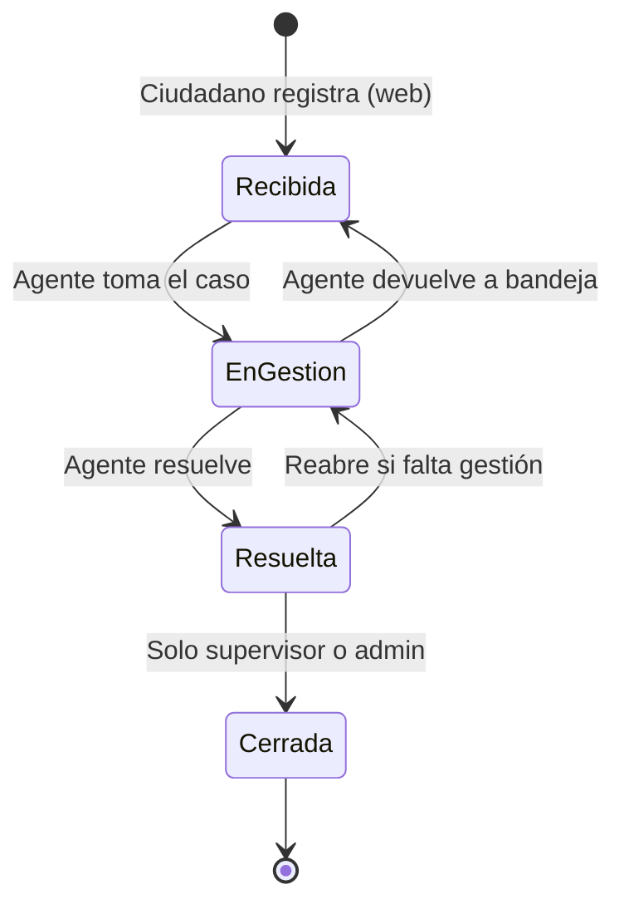
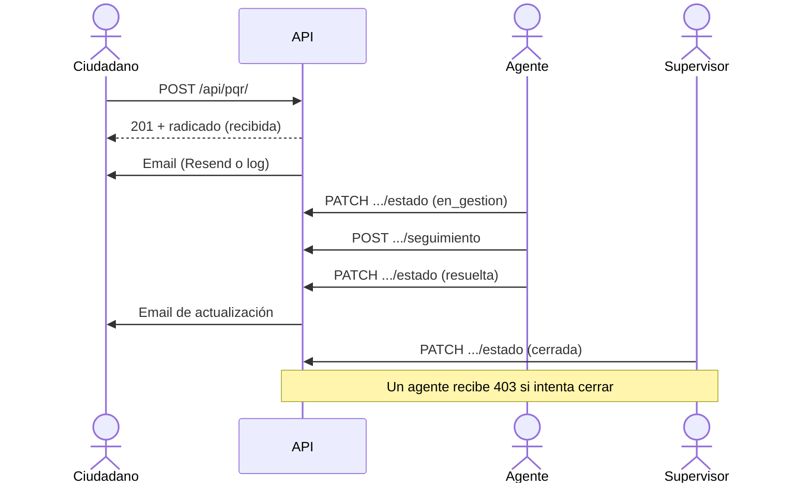

# Flujo del ciclo de vida de una PQR

## Actores

| Actor | Qué puede hacer |
|-------|-----------------|
| Ciudadano / colaborador | Registrar PQR, consultar por radicado (sin login) |
| Agente | Listar, filtrar, ver PII, cambiar estado (salvo cerrar), prioridad y seguimiento |
| Supervisor / Admin | Todo lo del agente + **cerrar** la PQR |

## Estados y transiciones

Reglas en código (`ALLOWED_TRANSITIONS` + validación de rol):

- `recibida` → `en_gestion`
- `en_gestion` → `resuelta` o `recibida`
- `resuelta` → `cerrada` o `en_gestion`
- `cerrada` → ninguna (estado final)
- Pasar a `cerrada` exige rol `supervisor` o `admin`

## Secuencia resumida

Cada cambio de estado o prioridad deja una fila en `seguimientos`. La creación deja un evento de sistema (`tipo_accion=sistema`).
